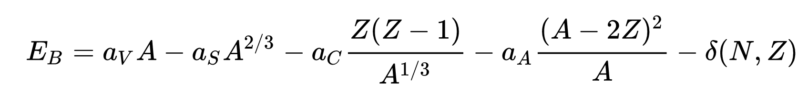

# Semi-Empirical Mass Formula in Rust

An implementation of the Semi-Empirical Mass Formula (SEMF) used in calculating the Binding Energies of atomic nuclei in Rust

## Implementation

This implementation uses the following version of SEMF

Each term of the equation is implemented as its own private function.

These sub-functions are then called in a main, public function which orders each private sub-function properly as well as feeding in the proper coefficients.

Due to the variation in coefficient values, there is a `struct` that allows you to define your own coefficients OR generate two commonly used variations (Both derived from linear fits of experimentally derived data)